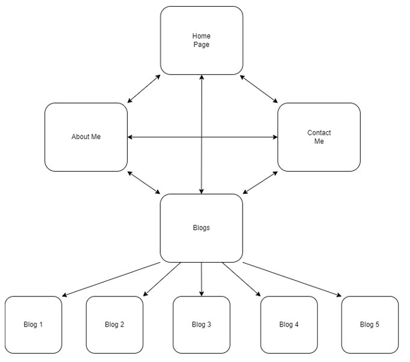

# <b>Jai Mathers Portfolio</b>

### <b>URL to Portfolio</b> (https://jaimathersportfolio.netlify.app)

### <b>GitHub Repo</b> (https://github.com/JaiMathers/Portfolio/tree/master)

=========================================================

## <b>Purpose</b>
The purpose of this portfolio is to provide a basis for seeking employment within the industry, showcasing my capabilites and personality as a coder.

## <b>Functionality/Features</b>
Features contained within this website include: 
- Semantic HTML tags for readers
- Navigation bar for fast and easy between all HTML pages
- Responsiveness for mobile, tablet, and desktop layouts
- Deutrenopia (Red+Green Colourblind) friendly scheme

The navigation bar has styling elements that indicate which page you're currently on via darker text colour, and hover elements that brighten the text along with a background to highlight the page you're selecting.

## <b>Sitemap</b>
The site has 4 HTML pages containing a navigation bar to move between pages with ease. From the blogs page, there are links to individual blog posts (placeholder).

===
## <b>Wireframes</b>

Wireframes for mobile, tablet, and desktop variations, showing original design concepts and rough guideline for planning CSS elements.

### _Home_
A few minor details were changed from the original process for the Home page, including placements of text, images, and the decision to remove animations as they didn't aid the design.

===
### _About Me_
Small additions were made to increase accessibility such as semantic tags, and backgrounds to text for improved clarity.

===
### _Blogs_
Card layout was implemented using combinations of flexbox and grid to ensure centering and responsiveness of elements. Faded coloured backgrounds were added to each blog container to increase visibility of text.

===
### _Contact Me_
Minimalist approach was used to ensure only necessary information was presented. The addition of a download résumé button was implemented after the original wireframe layout.

## <b>Screenshots</b>
The product will continue to be expanded upon and improved as time goes on. These are current state screenshots showing both mobile and desktop views. Tablet views were similar to mobile with no visual changes, and were therefore not added.

===

===

===

===
## <b>Target Audience</b>
The intended audience of this website are potential employers within the coding industry, as I am looking to make a career change into something more stimulating and rewarding for my efforts.

## <b>Tech Stack</b>
The languages used in this website are:
- _HTML_
- _CSS_

Languages and methods such as _Javascript_ and _SCSS_ were not utilized for the express purpose of time and practice.

This website is deployed via [Netlify](https://jaimathersportfolio.netlify.app), and calls upon my linked [GitHub repository](https://github.com/JaiMathers/Portfolio/tree/master).